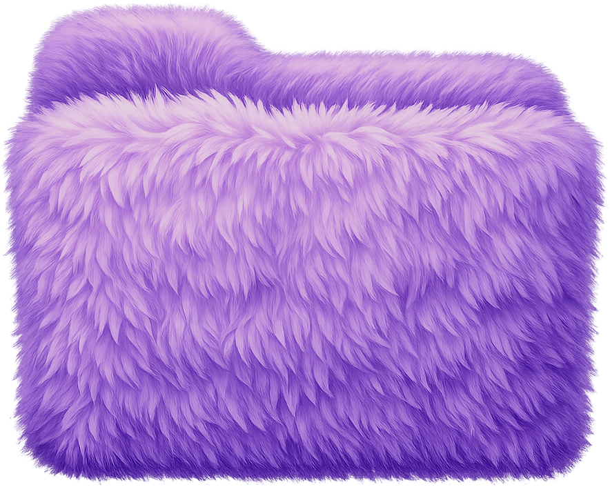
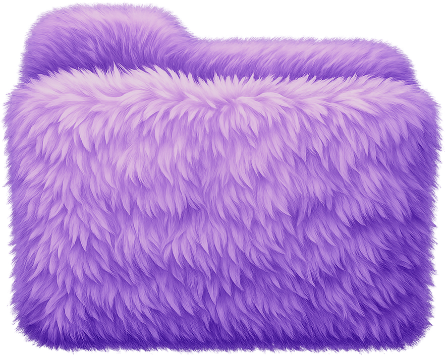
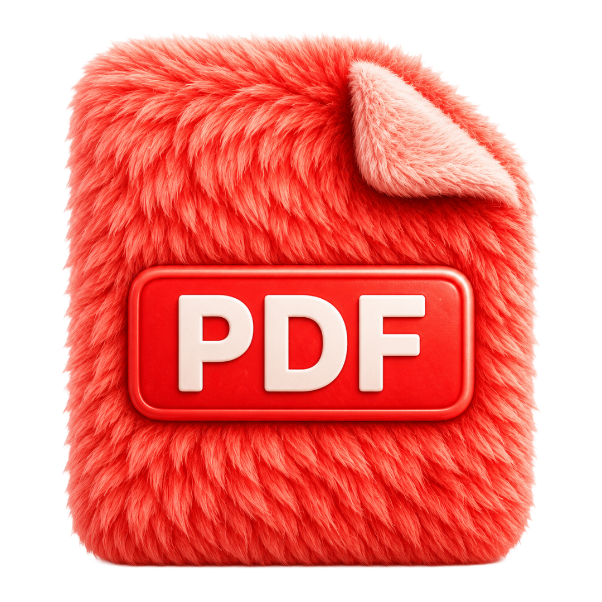
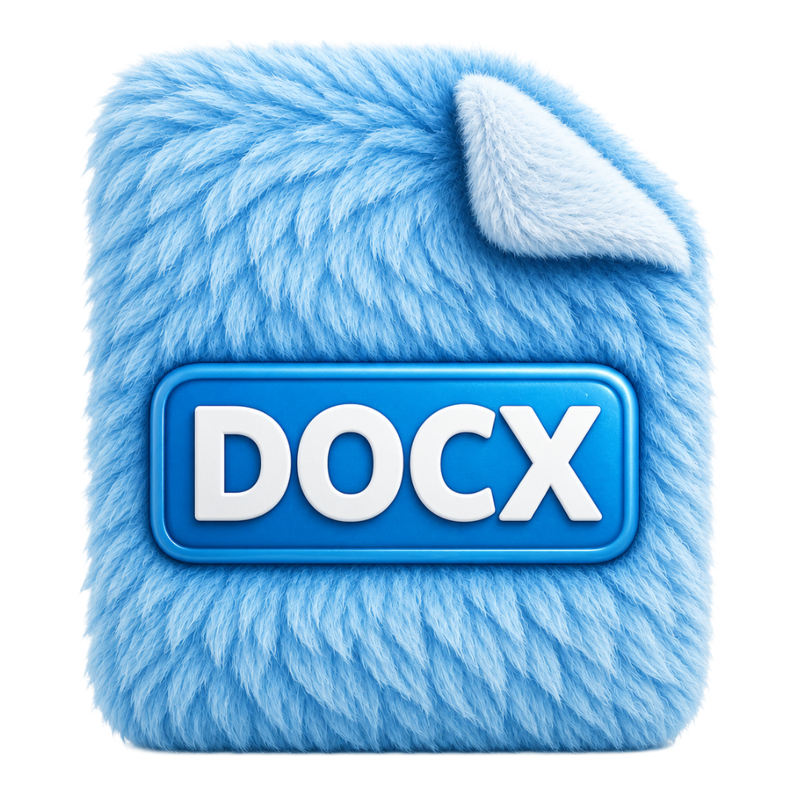
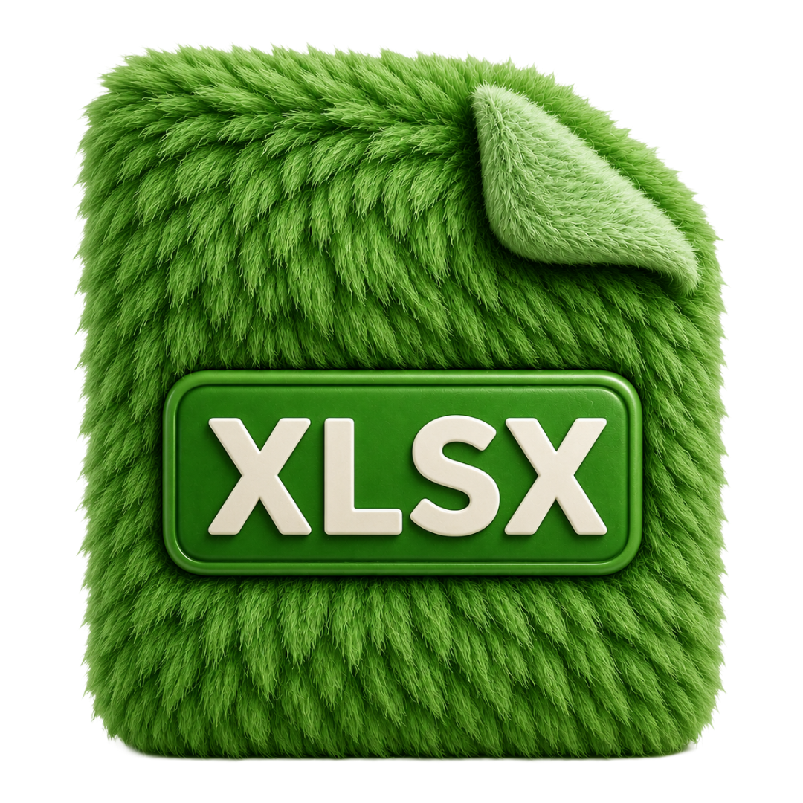
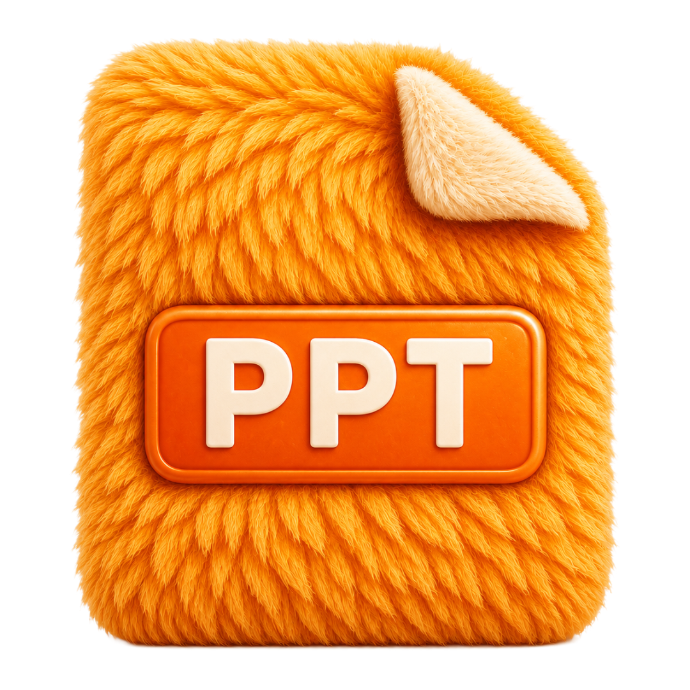
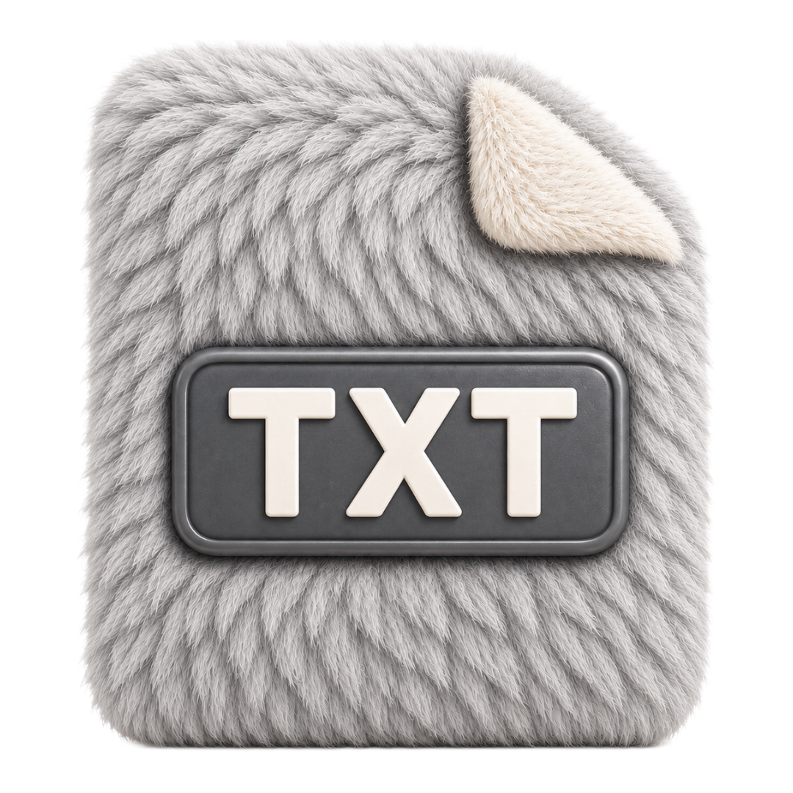
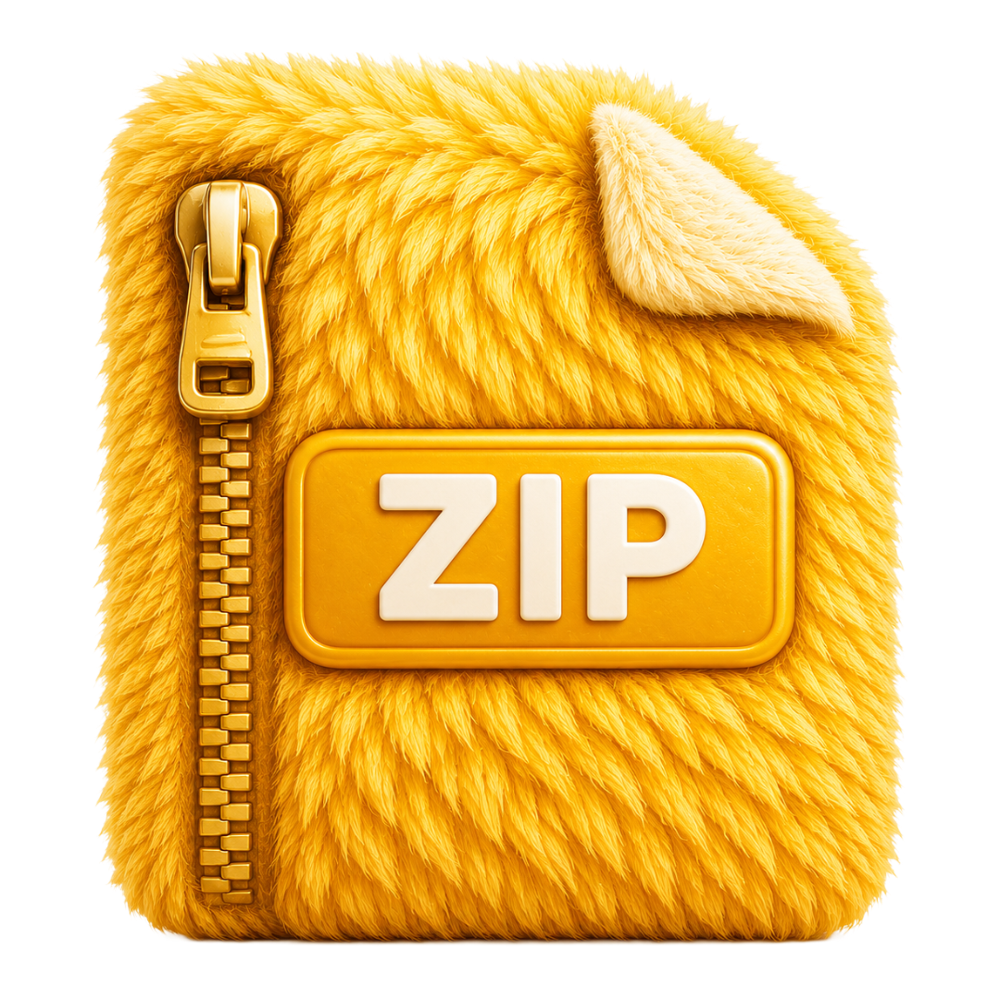
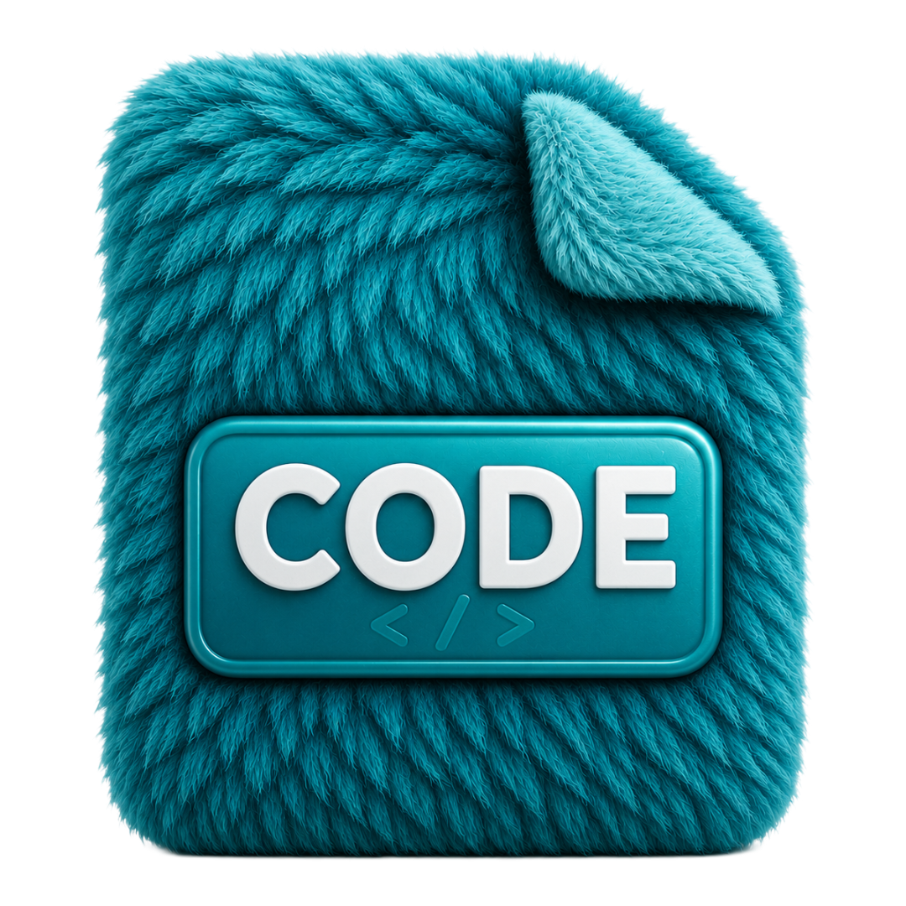
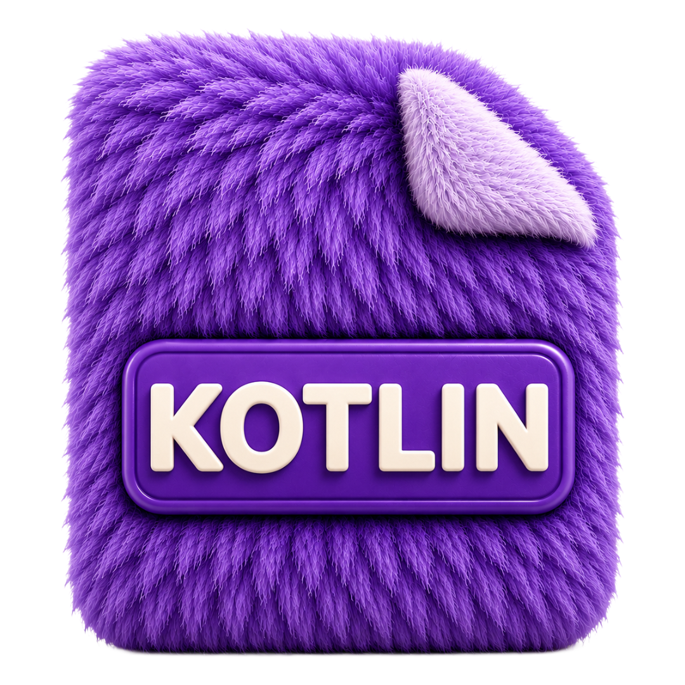

| <br><br><h1>Secure Box</h1><strong>your files, your way</strong><br><br>[](https://developer.android.com) [](https://kotlinlang.org) [](https://developer.android.com/jetpack/compose) |
|:-----------------------------------------------------------------------------------------------------------------------------------------------------------------------------------------------------------------------------------------------------------------------------------------------------------------------------------------------------------------------------------------------------------------------------------------------------------------------------------------------------------------------------------------------------------------------------------------:|

<br>

> A file manager that doesn't feel like one.
>
> No clutter. No bloat. Just your files, shown the way you want.

<br>

## What does it do?

It manages your files. That's it. But it does it well.

You open it. You see your recent files right there, with image thumbnails and custom file artwork instead of generic document icons. Want media? Images, Videos, Music, and Documents open real phone-wide collections sorted by latest, not just a random folder. Want the filesystem? Downloads and Internal Storage are still one tap away.

Every file can be renamed, copied, moved, or deleted. Long press -> pick what you want -> done. If you're copying or moving, you pick the folder. We show you a clean folder picker with a "paste here" button at the bottom.

It shows image thumbnails instantly. Folders show their sizes. Everything loads fast because it only loads what you can see.

<br>

## Screenshots

|                                                                                                           |                                                                                                           |                                                                                                           |
|:---------------------------------------------------------------------------------------------------------:|:---------------------------------------------------------------------------------------------------------:|:---------------------------------------------------------------------------------------------------------:|
|  |  |  |
|  |  |  |

<br>

## File icons

Files should be easy to recognize before you read the name. Secure Box uses custom artwork for common file types, so folders, documents, videos, archives, and code all feel distinct at a glance.

|                                             Folder                                              |                                              PDF                                               |                                                   Word                                                    |                                                  Sheet                                                  |
|:-----------------------------------------------------------------------------------------------:|:----------------------------------------------------------------------------------------------:|:---------------------------------------------------------------------------------------------------------:|:-------------------------------------------------------------------------------------------------------:|
|  |  |  |  |

|                                                 Slides                                                  |                                                 Text                                                 |                                               Video                                                |                                              Archive                                               |
|:-------------------------------------------------------------------------------------------------------:|:----------------------------------------------------------------------------------------------------:|:--------------------------------------------------------------------------------------------------:|:--------------------------------------------------------------------------------------------------:|
|  |  |  |  |

|                                               Code                                               |                                                Kotlin                                                |                                               HTML                                               |
|:------------------------------------------------------------------------------------------------:|:----------------------------------------------------------------------------------------------------:|:------------------------------------------------------------------------------------------------:|
|  |  |  |

<br>

## How it's built

No shortcuts. No tutorials copy-pasted. This is built from scratch to learn Android properly.

**The UI** is Jetpack Compose with Material 3. Every screen, Home, File Browser, Recents, Destination Picker, and media collections, is its own composable with its own ViewModel. The theme follows the device, light or dark, it adapts.

**The architecture** is MVVM with a repository layer. ViewModels hold the state. The repository talks to the file system. State flows down, events flow up. No weird callbacks, no spaghetti.

**File operations** use Kotlin's `Result<T>`. Every operation, rename, delete, copy, move, either succeeds or fails with a specific error. Not "something went wrong". You get "File not found" or "Permission denied" or "Name already exists". The exact problem.

**Navigation** uses Navigation3 with a simple back stack. No fragments. No XML. Just a list of screens.

<br>

## The stack

| Layer         | What                  | Why                                  |
|:--------------|:----------------------|:-------------------------------------|
| Language      | Kotlin                | Only choice for modern Android       |
| UI            | Jetpack Compose       | Declarative, fast, less code         |
| Design        | Material 3            | Looks native, supports dynamic color |
| DI            | Hilt                  | Inject once, use everywhere          |
| Images        | Coil 3                | Async loading, caching, thumbnails   |
| Navigation    | Navigation3           | Type-safe, composable-first          |
| Async         | Coroutines + Flow     | Non-blocking, lifecycle-aware        |
| Serialization | Kotlinx Serialization | Type-safe route args                 |

<br>

## Things I'm still working on

This is a learning project. It's not done. Here's what's next:

- [ ] Snackbar system using `Channel` instead of StateFlow strings
- [ ] Use cases for file operations (domain layer)
- [ ] Split the shared ViewModel - it's too big right now
- [ ] Search
- [ ] Favorites / pinned folders
- [ ] Multi-select for batch operations
- [ ] Sort and filter options in file browser

<br>

## Run it yourself

```bash
# Clone
git clone https://github.com/CodePandaaAI/Secure-Box.git

# Open in Android Studio, sync Gradle, run on device/emulator
# Needs "All Files Access" permission - the app will ask on first launch
```

> **Note:** Needs Android 11+ (API 30) for `MANAGE_EXTERNAL_STORAGE`. Works best on a real device; emulator file systems are mostly empty.

<br>

---

| Built by learning, not by copying.<br><br>Made with Kotlin, Compose, and a lot of late nights. |
|:----------------------------------------------------------------------------------------------:|
